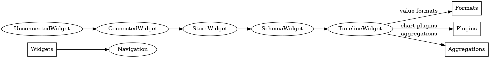

# Віджети React.js для Storage.Timeline

## Вступ
`Storage.Timeline` - це база даних для обробки даних у форматі часових рядів (таймлайнів).
Більше документації про базу даних можна знайти тут:
https://github.com/vitche/documentation-storage-timeline

|                |                                         |
|----------------|-----------------------------------------|
| **Автор №1**:  | Андрій Михайлов <andrew@vitche.com>     |
| **Автор №2**:  | Герман Степанов <germantv663@gmail.com> |
| **Версія**:    | 1.0                                     |
| **Дата**:      | 02.03.2024                              |

## Візуалізація даних часових рядів за допомогою компонентів інтерфейсу

У сфері аналізу даних та моніторингу важливою є можливість візуалізувати та взаємодіяти з даними часових рядів. `Storage.Timeline` - це надійна база даних, спеціально розроблена для обробки даних часових рядів, яка пропонує міцну основу для ефективного зберігання та отримання часових даних. Для використання повного потенціалу `Storage.Timeline`, розробникам та користувачам потрібен всеосяжний та зручний інтерфейс користувача (UI), який дозволяє інтуїтивно навігувати та візуалізувати дані часових рядів.

### Важливість UI в аналізі часових рядів

Дані часових рядів, за своєю природою, є величезними та складними, часто охоплюючи безліч точок даних на протязі неперервного часового спектру. Величезний обсяг даних може бути приголомшливим, ускладнюючи виявлення закономірностей, тенденцій та аномалій. Добре спроектований UI перекриває цю прогалину, надаючи інструменти та візуалізації, які перетворюють сиру інформацію в зрозумілі та придатні для дій відомості.

### Особливості ефективного UI для даних часових рядів

Ефективний UI для навігації даними `Storage.Timeline` повинен включати наступні функції:

- **Легка навігація по схемі сховища:** База даних `Storage.Timeline` розроблена для місткості кількох схем, які моделюють цільову область з перспективи часових рядів. Таким чином, навігація по кільком схемам повинна бути зручною.
- **Інтерактивний вибір діапазону часу:** Користувачі повинні мати можливість вибирати та модифікувати часовий діапазон даних, які вони хочуть переглянути, що дозволяє їм зосередитися на конкретних інтервалах інтересу.
- **Можливості збільшення та панорамування:** Для дослідження даних на різних рівнях деталізації, UI повинен пропонувати функції збільшення та панорамування, дозволяючи користувачам заглиблюватися в детальні перегляди або виходити на ширші огляди з легкістю.
- **Потокова передача даних у реальному часі:** Для додатків, яким потрібні дані оновлені до останньої хвилини, UI повинен підтримувати потокову передачу даних у реальному часі, динамічно оновлюючи візуалізації по мірі надходження нових даних.
- **Налаштовувані сюжети даних:** Різні випадки використання вимагають різних типів візуалізацій (наприклад, лінійні діаграми, стовпчасті графіки, теплові карти). Універсальний UI повинен надавати різноманітні налаштовувані сюжети даних для задоволення різних аналітичних потреб.
- **Анотації та маркери подій:** Користувачам часто потрібно відзначати значущі події або аномалії в даних. UI повинен дозволяти розміщувати анотації та маркери подій у візуалізаціях для легкого посилання та аналізу.
- **Реагуючий дизайн:** Зі зростанням використання мобільних пристроїв для аналізу даних, UI повинен бути реагуючим, забезпечуючи безперервний досвід на робочих столах, планшетах та смартфонах.

## Варінти використання інтерфейсу

### Інтеграція віджету `Storage.Timeline` до будь-якого вебсайту
Віджети інтерфейсу мають бути розроблені таким чином, щоб було можливо:
- Розміщувати віджети на будь-якому сторонньому вебсайті, який підтримує `React.js`.
- Відображати `Непідключений віджет`, який підключається до бази даних, вказаної користувачем.
- Відображати `Підключений віджет сховища`, який відразу показує всі схеми в зазначеному сховищі.
- Відображати `Підключений віджет схеми`, який відразу показує всі часові лінії в зазначеному сховищі та схемі.
- Відображати `Підключений віджет часової лінії`, який відразу показує всі значення часової лінії в зазначеному сховищі, схемі та часовій лінії.
- Навігувати від непідключеного віджету до віджету сховища, а потім до віджетів схеми та часової лінії.

### Підключення до бази даних
Для відображення контенту з певного сховища `Storage.Timeline`:

1. Користувач вказує URL до бази даних, як для версії #1, так і для версії #2 API. Наприклад, https://europe-west1-hype-dev.cloudfunctions.net/storage-timeline.
2. Користувач натискає `Підключитися`.
3. Відображається список схем у цьому сховищі `Storage.Timeline`.

### Навігація по `Сховищу`
`Підключений віджет сховища` показує список усіх схем у сховищі. Кожна схема є клікабельною.

### Навігація по `Схемі`
`Підключений віджет схеми` відображає список усіх часових ліній у схемі. Кожна часова лінія є клікабельною.

### Навігація по `Часовій Лінії`
- `Підключений віджет часової лінії` показує список усіх даних часової лінії.
- Можливо вибрати формат значення часової лінії:
    - Строка.
    - Число.
    - JSON документ.
- Можливо скопіювати значення до буфера обміну.
- Можливо завантажити подане значення як файл.
- **У МАЙБУТНЬОМУ**. Можливо відображати додаткові плагіни графіків, які показують дані часових рядів. Один плагін вже доступний, який показує дані біологічної активності.
- **У МАЙБУТНЬОМУ**. Можливо застосувати `Обчислення агрегатів в браузері` до даних часових рядів.

## Діаграма компонентів
Нижче наведено діаграму компонентів проекту:

## Висновок

Розробка всебічного та зручного інтерфейсу користувача для `Storage.Timeline` не є просто розкішшю; це необхідність для кожного, хто прагне використовувати потужність даних часових рядів. Такий інтерфейс наділить розробників, аналітиків та бізнес-користувачів здатністю приймати обізнані рішення на основі чітких, інтерактивних візуалізацій часових даних. Оскільки `Storage.Timeline` продовжує розвиватися, так само мають розвиватися і інструменти, які ми використовуємо для взаємодії з ним, забезпечуючи можливість повною мірою розкрити потенціал аналізу часових рядів.
